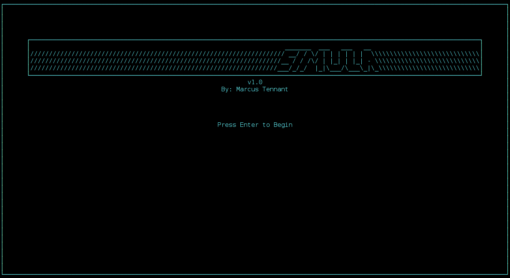
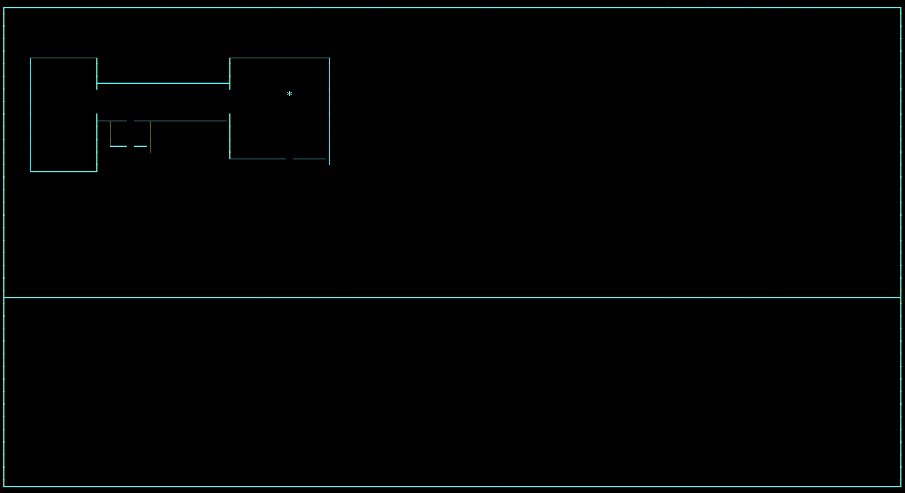

SIMULA
=======

SIMULA is a terminal RPG game engine written in C using the ncurses library. It is being developed mostly as a project to practice C memory management. 

It is still in very early stage development, and currently supports simple room creation, player movement, and collision.

